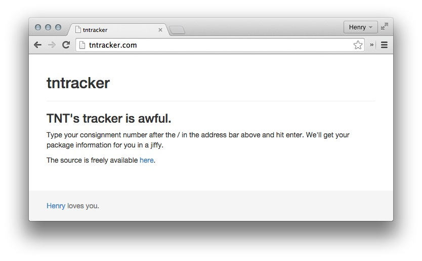

# tntracker 

A simple web tracker for your TNT parcels.

It works by going to TNT's awful web tracking page (which is literally unusable on a mobile device) using a headless browser, and pulling a table of shipment information to display to the screen. A nice little exercise in headless browsing and web scraping in Ruby.

## Installation and usage

Download. Run `bundle install` (you'll need a working Ruby install).

Then, from the app folder, run `rackup`. Go to http://localhost:9292/<your_TNT_tracking_number>, and it'll fetch the result for you.

## Technologies

* Sinatra
* Mechanize (for headless browsing)
* Nokogiri (for parsing and stripping out HTML before it gets put on the page)
* Dokku (for quick pushing to a Digital Ocean instance)

*(Truly, I stand on the shoulders of giants)*

